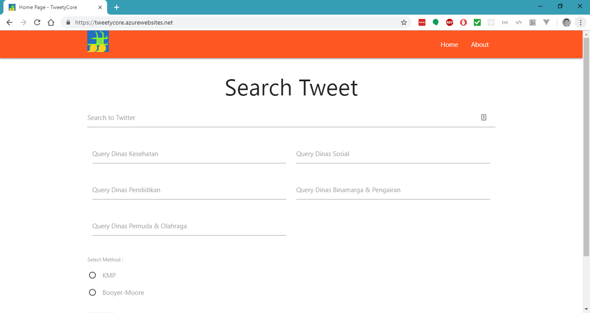

# Tweety

Tweety, Twitter Tweet Categorizer. Using KMP and Boyer Moore Algorithm that find matching string.

## Build Status

| Azure Pipelines | Github Action | Codecov | License Scan | Codacy |
|:---------------:|:-------------:|:-------:|:------------:|:------:|
|[](https://dev.azure.com/berviantoleo/Tweety/_build/latest?definitionId=3&branchName=master)|[](https://github.com/berv-uni-project/tweety/actions/workflows/dockerpush.yml)|[](https://codecov.io/gh/berv-uni-project/tweety)|[](https://app.fossa.io/projects/git%2Bgithub.com%2Fberv-uni-project%2Ftweety?ref=badge_shield)|[](https://www.codacy.com/gh/berv-uni-project/tweety/dashboard?utm_source=github.com&amp;utm_medium=referral&amp;utm_content=berv-uni-project/tweety&amp;utm_campaign=Badge_Grade)|

## Demo & Related Projects

- [MVC](https://tweety-core.azurewebsites.net/)
- [Tweety UI - Vue](https://tweety.onrender.com)

## About App



This app build with `C#` (Based Language for Logic in KMP & Boyer Moore Algorithm) and `ASP.NET MVC` (v0.1), `ASP.NET Core MVC` (v0.2).

This app using `Twitter API`, so you must have token key.

Youtube Review (v0.1) : [Youtube Link](https://www.youtube.com/watch?v=uGtZCm9duLw)

## Development

- Setup your Twitter API key in Environment

## Deployment

- You can deploy to Azure (read the documentation) to deploy ASP .NET Core MVC (v0.2 or above).

### Use Docker

You can use `docker-compose.yml` and provide environment like this:

```env
CUSTOMER_KEY=...
CUSTOMER_SECRET=...
TOKEN=...
TOKEN_SECRET=...
```

## Created By

1. [Bervianto Leo Pratama](https://github.com/berviantoleo)
2. [Jeremia Jason Lasiman](http://github.com/JeremiaJ)
3. [M. Az-zahid Adhitya Silparensi](https://github.com/Azzahid)

## LICENSE

BSD 3-Clause License

```markdown
BSD 3-Clause License

Copyright (c) 2018, Bervianto Leo Pratama
All rights reserved.

Redistribution and use in source and binary forms, with or without
modification, are permitted provided that the following conditions are met:

- Redistributions of source code must retain the above copyright notice, this
  list of conditions and the following disclaimer.

- Redistributions in binary form must reproduce the above copyright notice,
  this list of conditions and the following disclaimer in the documentation
  and/or other materials provided with the distribution.

- Neither the name of the copyright holder nor the names of its
  contributors may be used to endorse or promote products derived from
  this software without specific prior written permission.

THIS SOFTWARE IS PROVIDED BY THE COPYRIGHT HOLDERS AND CONTRIBUTORS "AS IS"
AND ANY EXPRESS OR IMPLIED WARRANTIES, INCLUDING, BUT NOT LIMITED TO, THE
IMPLIED WARRANTIES OF MERCHANTABILITY AND FITNESS FOR A PARTICULAR PURPOSE ARE
DISCLAIMED. IN NO EVENT SHALL THE COPYRIGHT HOLDER OR CONTRIBUTORS BE LIABLE
FOR ANY DIRECT, INDIRECT, INCIDENTAL, SPECIAL, EXEMPLARY, OR CONSEQUENTIAL
DAMAGES (INCLUDING, BUT NOT LIMITED TO, PROCUREMENT OF SUBSTITUTE GOODS OR
SERVICES; LOSS OF USE, DATA, OR PROFITS; OR BUSINESS INTERRUPTION) HOWEVER
CAUSED AND ON ANY THEORY OF LIABILITY, WHETHER IN CONTRACT, STRICT LIABILITY,
OR TORT (INCLUDING NEGLIGENCE OR OTHERWISE) ARISING IN ANY WAY OUT OF THE USE
OF THIS SOFTWARE, EVEN IF ADVISED OF THE POSSIBILITY OF SUCH DAMAGE.
```

[](https://app.fossa.io/projects/git%2Bgithub.com%2Fberv-uni-project%2Ftweety?ref=badge_large)
